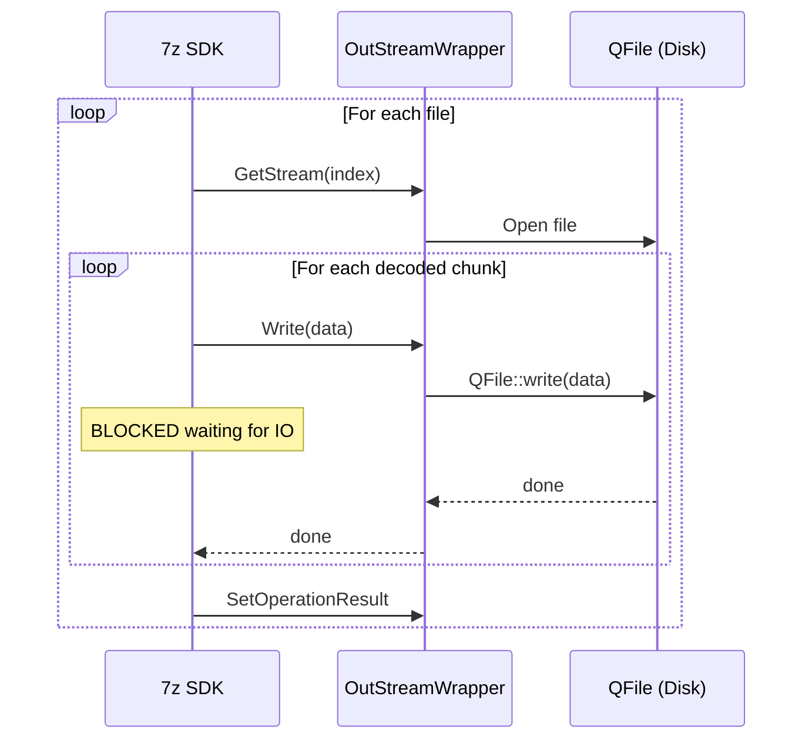
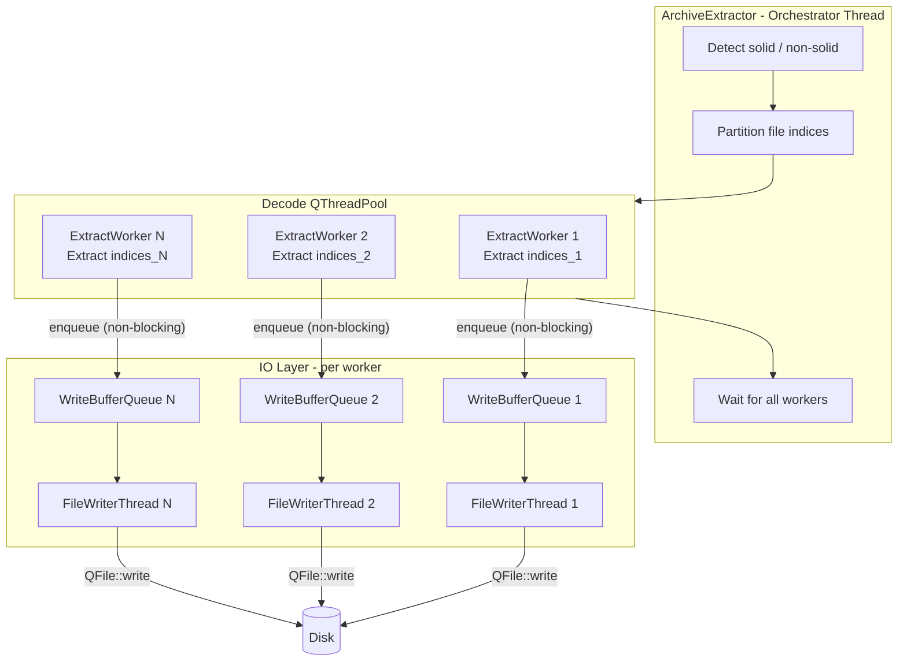
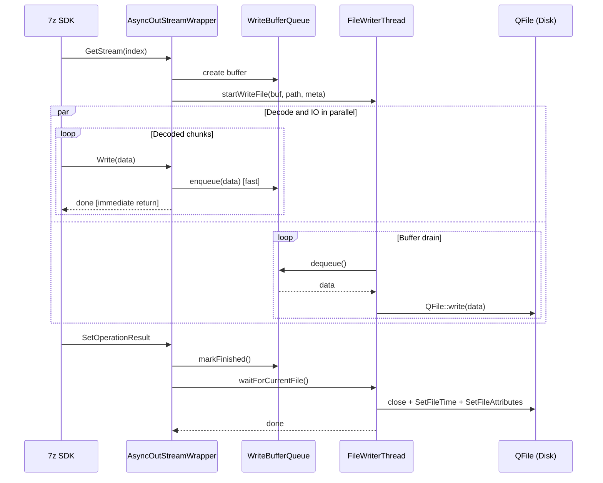

# Async Parallel Extraction Pipeline

## Problem Analysis

Current extraction flow in [archiveextractor.cpp](KeyZip/archiveextractor.cpp) is fully serial within a single thread:




Two bottlenecks:

1. **Decode-IO coupling**: Every `OutStreamWrapper::Write()` call in [outstreamwrapper.cpp](KeyZip/outstreamwrapper.cpp) does synchronous `QFile::write()`, blocking the decoder until the OS completes the disk write.
2. **Single-threaded decode**: Only one `Extract()` call runs at a time, even for formats like ZIP where each file is independently compressed.

## Target Architecture




**Key principle**: The decoder's `Write()` call copies data into an in-memory bounded buffer and returns immediately. A dedicated IO thread drains the buffer and writes to disk in parallel. Backpressure is applied when the buffer is full (decoder blocks on enqueue), preventing unbounded memory growth.

## Strategy by Archive Format


| Format         | Solid? | Decode Threads                               | Async IO |
| -------------- | ------ | -------------------------------------------- | -------- |
| ZIP            | No     | N workers, each handles a partition of files | Yes      |
| 7z (non-solid) | No     | N workers                                    | Yes      |
| 7z (solid)     | Yes    | 1 worker (SDK constraint)                    | Yes      |
| RAR            | Varies | 1 worker (conservative)                      | Yes      |


Detection: query `kpidSolid` property from the archive via `IInArchive::GetArchiveProperty()`.

## Component Design

### 1. WriteBufferQueue (new: `writebufferqueue.h/.cpp`)

Thread-safe bounded queue using `QMutex` + `QWaitCondition`.

```cpp
class WriteBufferQueue {
public:
    explicit WriteBufferQueue(qint64 maxBufferBytes = 4 * 1024 * 1024);
    void enqueue(const char* data, quint32 size);  // blocks if full
    QByteArray dequeue();                           // blocks if empty
    void markFinished();
    bool isFinished() const;
private:
    QQueue<QByteArray> m_queue;
    QMutex m_mutex;
    QWaitCondition m_notFull, m_notEmpty;
    qint64 m_currentBytes = 0;
    qint64 m_maxBytes;
    bool m_finished = false;
};
```

### 2. AsyncOutStreamWrapper (new: `asyncoutstreamwrapper.h/.cpp`)

Drop-in replacement for [OutStreamWrapper](KeyZip/outstreamwrapper.h), implements `ISequentialOutStream`. `Write()` enqueues data to `WriteBufferQueue` instead of doing disk IO.

```cpp
STDMETHODIMP AsyncOutStreamWrapper::Write(const void* data, UInt32 size, UInt32* processedSize) {
    m_bufferQueue->enqueue(static_cast<const char*>(data), size);
    if (processedSize) *processedSize = size;
    return S_OK;
}
```

### 3. FileWriterThread (new: `filewriterthread.h/.cpp`)

A persistent `QThread` that consumes data from `WriteBufferQueue` instances and writes to disk. Handles the full lifecycle: open file, drain buffer, close file, set timestamps/attributes.

- `startWriteFile(WriteBufferQueue* queue, const QString& path, const FileMetadata& meta)` - begin writing a new file
- `waitForCurrentFile()` - block until the current file is fully written (called at `SetOperationResult` time)
- Each decode worker owns exactly one `FileWriterThread` instance

```cpp
struct FileMetadata {
    FILETIME ctime, atime, mtime;
    DWORD attributes;
    bool hasTime = false;
    bool hasAttributes = false;
};
```

### 4. ExtractWorker (new: `extractworker.h/.cpp`)

A `QRunnable` submitted to a `QThreadPool`. Each worker:

- Opens its own `IInArchive` instance via `CommonHelper::tryOpenArchive()`
- Creates its own `FileWriterThread`
- Creates its own `ArchiveExtractCallBack` (modified for async IO)
- Calls `archive->Extract(indices, count, false, callback)` with its assigned file indices
- Reports per-worker progress via `QAtomicInteger` shared with the orchestrator

```cpp
class ExtractWorker : public QRunnable {
public:
    void setIndices(const QVector<UInt32>& indices);
    void setArchivePath(const QString& path);
    void setDestDirPath(const QString& destDir);
    void setPassword(const QString& password);
    void setProgressCounter(QAtomicInteger<quint64>* counter);
    void run() override;
};
```

### 5. Modify ArchiveExtractCallBack ([archiveextractcallback.h/.cpp](KeyZip/archiveextractcallback.h))

- `GetStream()`: pre-fetch file metadata (timestamps, attributes) from the archive. Create `WriteBufferQueue` + `AsyncOutStreamWrapper`. Signal `FileWriterThread` to start a new file.
- `SetOperationResult()`: call `m_bufferQueue->markFinished()` then `m_writerThread->waitForCurrentFile()` (small sync point per file, necessary for correctness). Remove the direct `SetFileTime`/`SetFileAttributes` calls -- those move to `FileWriterThread`.

### 6. Refactor ArchiveExtractor ([archiveextractor.h/.cpp](KeyZip/archiveextractor.h))

The orchestrator:

```cpp
void ArchiveExtractor::run() {
    // 1. Open archive, get item count
    // 2. Detect solid via kpidSolid
    // 3. Enumerate file indices (respecting m_entryPath filter)
    // 4. Partition indices based on solid flag:
    //    - Non-solid: split into N groups (N = QThread::idealThreadCount())
    //    - Solid: single group
    // 5. Create QThreadPool, submit ExtractWorkers
    // 6. Poll shared QAtomicInteger progress counter, emit updateProgress
    // 7. Wait for pool completion
    // 8. Emit extractSucceed / extractFailed
}
```

Progress polling: a timer loop (e.g., `QThread::msleep(200)`) reads the shared atomic counter and emits `updateProgress`. This replaces the current `BlockingQueuedConnection` progress signal which would block decode threads.

### 7. Update KeyZipWindow ([keyzipwindow.cpp](KeyZip/keyzipwindow.cpp))

- The `updateProgress` signal from `ArchiveExtractor` changes from `BlockingQueuedConnection` to `QueuedConnection` (since progress is now polled and emitted by the orchestrator, not by the decode callback directly).
- No other UI changes needed -- the `startArchiveExtractor()` interface stays the same.

### 8. Update CMakeLists.txt ([CMakeLists.txt](KeyZip/CMakeLists.txt))

Add new source files:

- `writebufferqueue.h`, `writebufferqueue.cpp`
- `asyncoutstreamwrapper.h`, `asyncoutstreamwrapper.cpp`
- `filewriterthread.h`, `filewriterthread.cpp`
- `extractworker.h`, `extractworker.cpp`

## Data Flow (After Refactoring)




## Performance Considerations

- **Buffer size tuning**: Default 4MB per buffer. The 7z SDK typically produces 64KB-256KB chunks, so a 4MB buffer holds 16-64 chunks, giving the decoder ample runway before blocking.
- **Thread count**: Use `QThread::idealThreadCount()` for decode workers (capped at file count). For archives with very many small files, fewer threads may be more efficient to reduce overhead.
- **Memory bound**: With N decode workers and 4MB per buffer, peak additional memory is N * 4MB (e.g., 32MB for 8 workers). Acceptable.
- **Disk IO saturation**: Multiple writer threads will naturally saturate disk bandwidth. For HDD, too many parallel writers can cause seek thrashing -- consider limiting IO threads on spinning disks. For SSD, parallel writes are beneficial.

